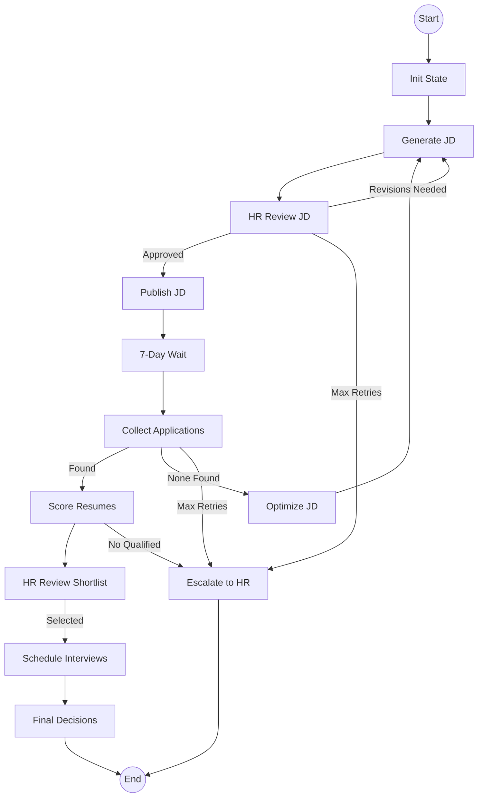

# Hiring AI: Autonomous Recruitment System 🤖

Welcome! This repository hosts an end-to-end recruitment automation pipeline. It uses **LangChain** and **LangGraph** to manage a complex hiring workflow—from drafting a Job Description (JD) to scheduling interviews—autonomously.

---

## 🧠 For Newcomers: What are LangChain & LangGraph?

If you are new to these technologies, here is the mental model:

### What is LangChain?
LangChain is a framework for building applications with Large Language Models (LLMs). It provides "bricks" to:
- Connect to models (OpenAI, Google Gemini, etc.).
- Create "Chains" (sequences of actions).
- Use **Tools** (e.g., sending an email, checking a calendar, or reading a local file).

### What is LangGraph?
While LangChain handles simple sequences, **LangGraph** is used for **cycles and state machines**. 
- **Nodes**: Think of these as "steps" in the process (e.g., `generate_jd`, `score_resumes`).
- **Edges**: These are the "rules" that connect nodes. **Conditional Edges** allow the system to make decisions (e.g., "If HR rejected the JD, go back to the generation step").
- **State**: A central dictionary (`HiringState`) that travels through the graph, carrying all the data needed for the current run.

---

## 🏗️ Architecture & What's Done

We have recently refactored the project to follow a **declarative LangGraph architecture**. This makes the system more robust, easier to debug, and supports "Human-in-the-Loop" interactions.

### The Pipeline Loop
The system follows this flow (managed in `src/graph/pipeline.py`):

### ✅ Key Features Implemented
- **Pure Node Logic**: Nodes focus only on execution (using `@tool`). No messy `if/else` logic inside functions.
- **Conditional Routing**: All decision-making logic is centralized in the graph definition.
- **State Persistence**: Using **PostgresSaver**, the pipeline can "sleep" (e.g., waiting 7 days for applicants) and resume exactly where it left off, even if the server restarts.
- **Human-in-the-Loop**: Integrated `interrupt()` points for critical HR approvals.
- **Async Execution**: Integrated with **Celery** for handling long-running waits (like the 7-day job posting period) without blocking the thread.

---

## 📂 Project Structure

- `src/graph/`: The "brain" of the system (`pipeline.py`).
- `src/nodes/`: Individual logic blocks (JD generation, resume scoring, etc.).
- `src/state/`: definition of the `HiringState` (`schema.py`).
- `src/tools/`: LLM factories and external API integrations (Email, Calendar).
- `src/scheduler/`: Celery application to handle time-based triggers.
- `src/api/`: FastAPI entry points to start and monitor pipelines.

---

## 🚀 Next Steps (What we need to do)

To make the system production-ready, we should focus on:
1. **Frontend Dashboard**: A UI for the hiring manager to view the "State" of any given job pipeline in real-time.
2. **Resume Source Expansion**: Currently, it scans a local directory. We should add tools to pull from LinkedIn or Greenhouse.
3. **Enhanced Interview Scheduling**: Support for more complex calendar logic (handling multiple interviewers).
4. **Local LLM Support**: Testing with Ollama to handle sensitive resume data locally for privacy-conscious clients.

---

## 🛠️ Setup

1. **Environment**: Copy `.env.example` to `.env` and fill in your API keys (OpenAI, Google, etc.).
2. **Install Dependencies**: `pip install -r requirements.txt`.
3. **Database**: Ensure PostgreSQL and Redis are running (or use `docker-compose up -d`).
4. **Run**: 
   - Start the API: `python -m src.api.main`
   - Start Celery Worker: `celery -A src.scheduler.celery_app worker --loglevel=info`

---

Let's automate hiring! 🚀
